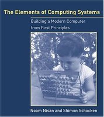

# The Elements of Computing Systems [](https://travis-ci.org/Sitebase/The-Elements-of-Computing-Systems)
This repository contains all my implementations for the projects described in the book `The Elements of Computing Systems`.



## Getting started
To run the tests an compile the code you needs some tools. These tools can easily be installed by running following command in the repo root folder:

```
make install
```

## Unit test
To run the unit tests execute following command:

```
make test
```

## Notes
If you download the project files from the Nand2Tetris website you'll notice that all project files contain Windows carriage return characters (`^M`). To remove these I used following command. `dos2unix` can be install on OSX using `brew install dos2unix`.

```
find . -type f -exec dos2unix {} \;
```
